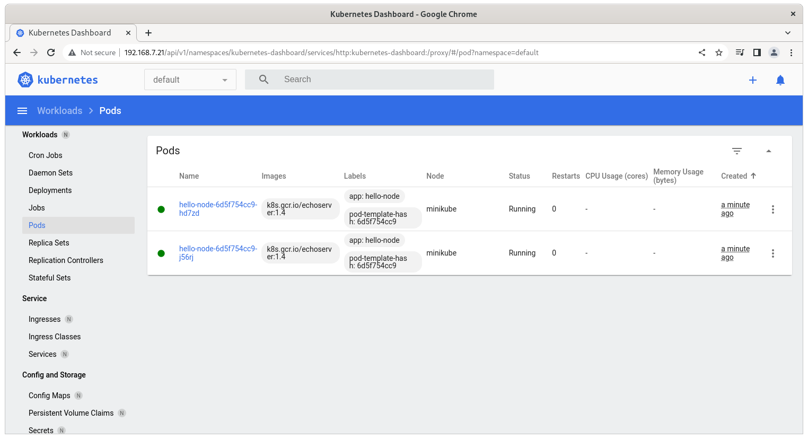
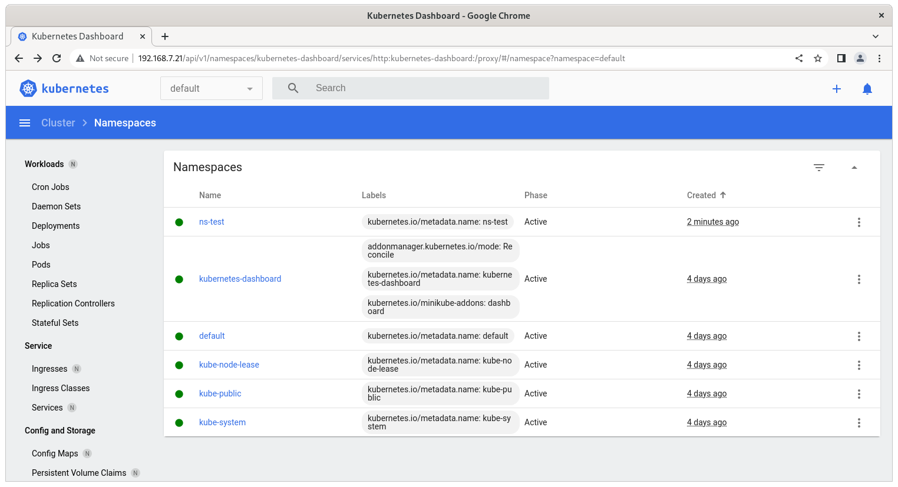
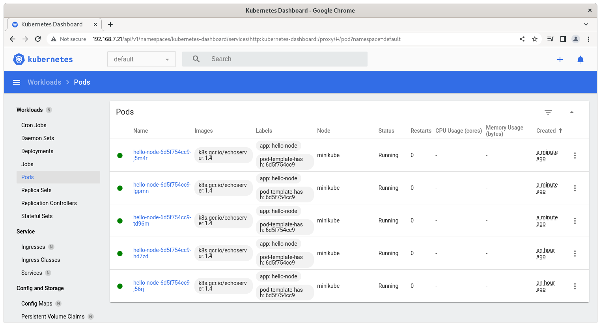
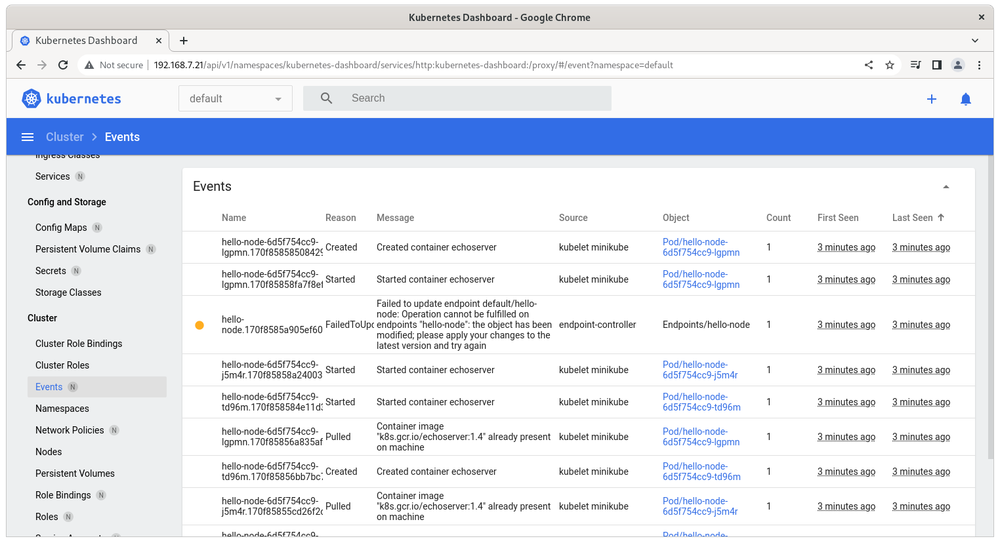
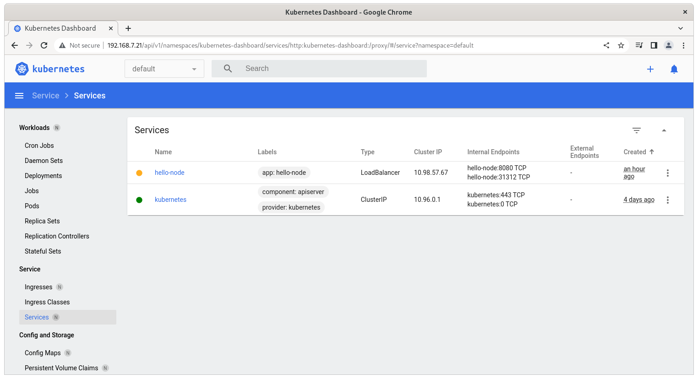
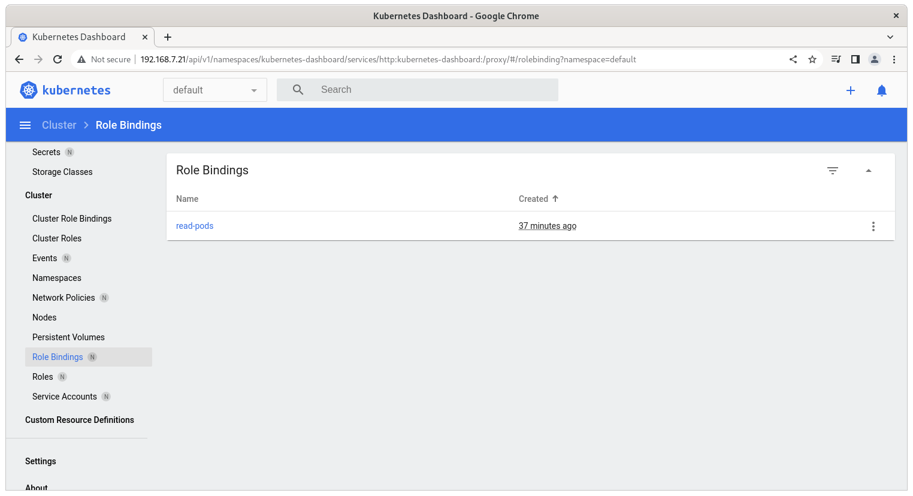
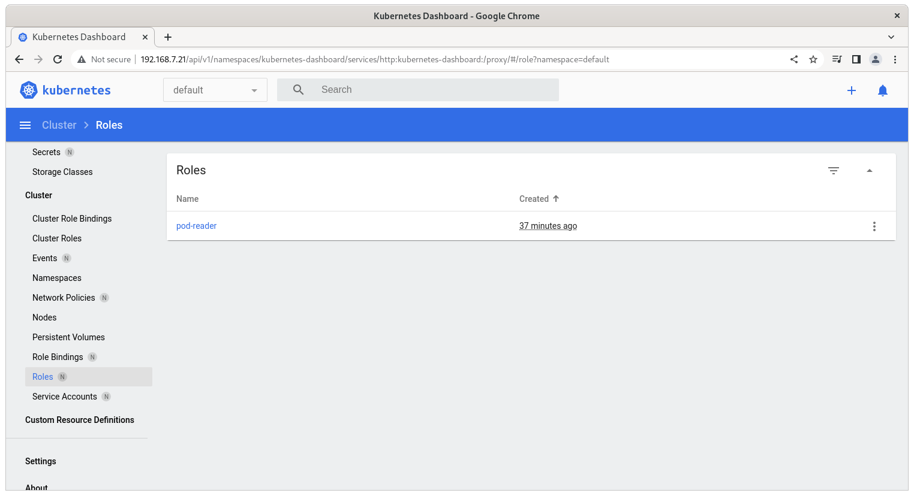

# Домашнее задание к занятию "12.2 Команды для работы с Kubernetes"
Кластер — это сложная система, с которой крайне редко работает один человек. Квалифицированный devops умеет наладить работу всей команды, занимающейся каким-либо сервисом.
После знакомства с кластером вас попросили выдать доступ нескольким разработчикам. Помимо этого требуется служебный аккаунт для просмотра логов.

## Задание 1: Запуск пода из образа в деплойменте
Для начала следует разобраться с прямым запуском приложений из консоли. Такой подход поможет быстро развернуть инструменты отладки в кластере. Требуется запустить деплоймент на основе образа из hello world уже через deployment. Сразу стоит запустить 2 копии приложения (replicas=2). 

Требования:
 * пример из hello world запущен в качестве deployment
 * количество реплик в deployment установлено в 2
 * наличие deployment можно проверить командой kubectl get deployment
 * наличие подов можно проверить командой kubectl get pods

```bash
iva@u20n1:~$ kubectl delete deployment hello-node
deployment.apps "hello-node" deleted
iva@u20n1:~$ kubectl create deployment hello-node --image=k8s.gcr.io/echoserver:1.4 --replicas=2
deployment.apps/hello-node created
iva@u20n1:~$ kubectl get deployment
NAME         READY   UP-TO-DATE   AVAILABLE   AGE
hello-node   2/2     2            2           2m5s
iva@u20n1:~$ kubectl get pods
NAME                          READY   STATUS    RESTARTS   AGE
hello-node-6d5f754cc9-hd7zd   1/1     Running   0          4m25s
hello-node-6d5f754cc9-j56rj   1/1     Running   0          4m25s
```


## Задание 2: Просмотр логов для разработки
Разработчикам крайне важно получать обратную связь от штатно работающего приложения и, еще важнее, об ошибках в его работе. 
Требуется создать пользователя и выдать ему доступ на чтение конфигурации и логов подов в app-namespace.

Требования: 
 * создан новый токен доступа для пользователя
 * пользователь прописан в локальный конфиг (~/.kube/config, блок users)
 * пользователь может просматривать логи подов и их конфигурацию (kubectl logs pod <pod_id>, kubectl describe pod <pod_id>)

```bash
iva@u20n1:~$ mkdir -p cert && cd cert
iva@u20n1:~/cert$ openssl genrsa -out kub_user.key 2048
Generating RSA private key, 2048 bit long modulus (2 primes)
.................................................................................................+++++
..................................+++++
e is 65537 (0x010001)
iva@u20n1:~/cert$ openssl req -new -key kub_user.key -out kub_user.csr -subj "/CN=kubuser/O=kub_group"
iva@u20n1:~/cert$ openssl x509 -req -in kub_user.csr -CA ~/.minikube/ca.crt -CAkey ~/.minikube/ca.key -CAcreateserial -out kub_user.crt -days 500
Signature ok
subject=CN = kubuser, O = kub_group
Getting CA Private Key
iva@u20n1:~/cert$ 

iva@u20n1:~/cert$ kubectl config set-credentials kube_user --client-certificate=kube_user.crt --client-key=kube_user.key
User "kube_user" set.

iva@u20n1:~/cert$ kubectl config set-context kubeuser-context --cluster=minikube --user=kube_user
Context "kubeuser-context" created.

iva@u20n1:~/cert$ kubectl config view
apiVersion: v1
clusters:
- cluster:
    certificate-authority: /home/iva/.minikube/ca.crt
    extensions:
    - extension:
        last-update: Sun, 28 Aug 2022 09:36:03 UTC
        provider: minikube.sigs.k8s.io
        version: v1.26.1
      name: cluster_info
    server: https://192.168.49.2:8443
  name: minikube
contexts:
- context:
    cluster: minikube
    user: kube_user
  name: kubeuser-context
- context:
    cluster: minikube
    extensions:
    - extension:
        last-update: Sun, 28 Aug 2022 09:36:03 UTC
        provider: minikube.sigs.k8s.io
        version: v1.26.1
      name: context_info
    namespace: default
    user: minikube
  name: minikube
current-context: minikube
kind: Config
preferences: {}
users:
- name: kube_user
  user:
    client-certificate: /home/iva/cert/kube_user.crt
    client-key: /home/iva/cert/kube_user.key
- name: minikube
  user:
    client-certificate: /home/iva/.minikube/profiles/minikube/client.crt
    client-key: /home/iva/.minikube/profiles/minikube/client.key

iva@u20n1:~/cert$ touch role.yaml
iva@u20n1:~/cert$ vi role.yaml 
iva@u20n1:~/cert$ touch role-binding.yaml
iva@u20n1:~/cert$ vi role-binding.yaml 
iva@u20n1:~/cert$ kubectl apply -f role.yaml
role.rbac.authorization.k8s.io/pod-reader created
iva@u20n1:~/cert$ kubectl apply -f role-binding.yaml
rolebinding.rbac.authorization.k8s.io/read-pods created
iva@u20n1:~/cert$ kubectl get roles
NAME         CREATED AT
pod-reader   2022-08-28T12:59:58Z
iva@u20n1:~/cert$ kubectl get rolebindings
NAME        ROLE              AGE
read-pods   Role/pod-reader   20s
iva@u20n1:~/cert$ kubectl create namespace ns-test
namespace/ns-test created
iva@u20n1:~/cert$ kubectl get pods
NAME                          READY   STATUS    RESTARTS   AGE
hello-node-6d5f754cc9-hd7zd   1/1     Running   0          74m
hello-node-6d5f754cc9-j56rj   1/1     Running   0          74m

iva@u20n1:~/cert$ kubectl logs hello-node-6d5f754cc9-hd7zd
172.17.0.1 - - [28/Aug/2022:12:04:28 +0000] "GET /favicon.ico HTTP/1.0" 200 586 "http://192.168.7.21:8080/" "Mozilla/5.0 (X11; Linux x86_64) AppleWebKit/537.36 (KHTML, like Gecko) Chrome/104.0.0.0 Safari/537.36"
iva@u20n1:~/cert$ kubectl logs hello-node-6d5f754cc9-j56rj
172.17.0.1 - - [28/Aug/2022:12:04:28 +0000] "GET / HTTP/1.0" 200 629 "-" "Mozilla/5.0 (X11; Linux x86_64) AppleWebKit/537.36 (KHTML, like Gecko) Chrome/104.0.0.0 Safari/537.36"

iva@u20n1:~/cert$ kubectl describe pod hello-node-6d5f754cc9-j56rj 
Name:             hello-node-6d5f754cc9-j56rj
Namespace:        default
Priority:         0
Service Account:  default
Node:             minikube/192.168.49.2
Start Time:       Sun, 28 Aug 2022 11:46:17 +0000
Labels:           app=hello-node
                  pod-template-hash=6d5f754cc9
Annotations:      <none>
Status:           Running
IP:               172.17.0.6
IPs:
  IP:           172.17.0.6
Controlled By:  ReplicaSet/hello-node-6d5f754cc9
Containers:
  echoserver:
    Container ID:   docker://b20447500a4a81e6609438d9143e1f2e9e8ef6f53871ce1fa69668546ec722ab
    Image:          k8s.gcr.io/echoserver:1.4
    Image ID:       docker-pullable://k8s.gcr.io/echoserver@sha256:5d99aa1120524c801bc8c1a7077e8f5ec122ba16b6dda1a5d3826057f67b9bcb
    Port:           <none>
    Host Port:      <none>
    State:          Running
      Started:      Sun, 28 Aug 2022 11:46:18 +0000
    Ready:          True
    Restart Count:  0
    Environment:    <none>
    Mounts:
      /var/run/secrets/kubernetes.io/serviceaccount from kube-api-access-vchsw (ro)
Conditions:
  Type              Status
  Initialized       True 
  Ready             True 
  ContainersReady   True 
  PodScheduled      True 
Volumes:
  kube-api-access-vchsw:
    Type:                    Projected (a volume that contains injected data from multiple sources)
    TokenExpirationSeconds:  3607
    ConfigMapName:           kube-root-ca.crt
    ConfigMapOptional:       <nil>
    DownwardAPI:             true
QoS Class:                   BestEffort
Node-Selectors:              <none>
Tolerations:                 node.kubernetes.io/not-ready:NoExecute op=Exists for 300s
                             node.kubernetes.io/unreachable:NoExecute op=Exists for 300s
Events:                      <none>

```


## Задание 3: Изменение количества реплик 
Поработав с приложением, вы получили запрос на увеличение количества реплик приложения для нагрузки. Необходимо изменить запущенный deployment, увеличив количество реплик до 5. Посмотрите статус запущенных подов после увеличения реплик. 

Требования:
 * в deployment из задания 1 изменено количество реплик на 5
 * проверить что все поды перешли в статус running (kubectl get pods)


```bash
iva@u20n1:~/cert$ kubectl scale --replicas=5 deployment hello-node
deployment.apps/hello-node scaled

iva@u20n1:~/cert$ kubectl get pods
NAME                          READY   STATUS    RESTARTS   AGE
hello-node-6d5f754cc9-hd7zd   1/1     Running   0          107m
hello-node-6d5f754cc9-j56rj   1/1     Running   0          107m
hello-node-6d5f754cc9-j5m4r   1/1     Running   0          51s
hello-node-6d5f754cc9-lgpmn   1/1     Running   0          51s
hello-node-6d5f754cc9-td96m   1/1     Running   0          51s

```

-----------------------













---

### Как оформить ДЗ?

Выполненное домашнее задание пришлите ссылкой на .md-файл в вашем репозитории.

---
